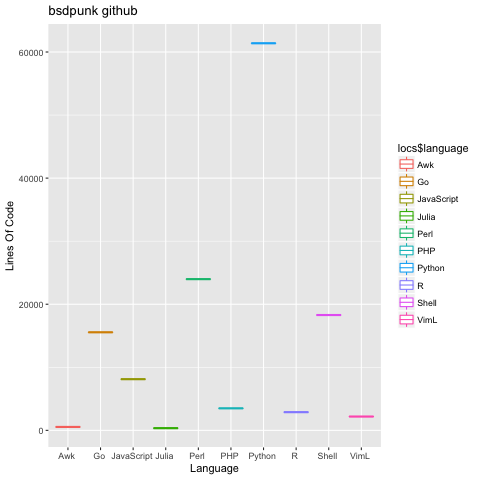

# github-lang
Get language usage statistics on a github user.
Does not count forked projects.
Does not count HTML or CSS as a language.

Best use with a github token.

```
bash get_percentages.sh
```

Will ask if you have a token, then ask for the user you want.


```
$ bash get_percentages.sh 
Enter your github token, if you have one. Otherwise hit enter: 

Enter which github user you would like to check percentages on: bsdpunk

Total LoC: 286124
AppleScript 696 0.243251%
Awk 539 0.18838%
Go 15548 5.43401%
JavaScript 8729 3.05078%
Perl 22547 7.88015%
PHP 20528 7.17451%
Python 207902 72.6615%
R 1926 0.673135%
Shell 6775 2.36785%
VimL 934 0.326432%
```

